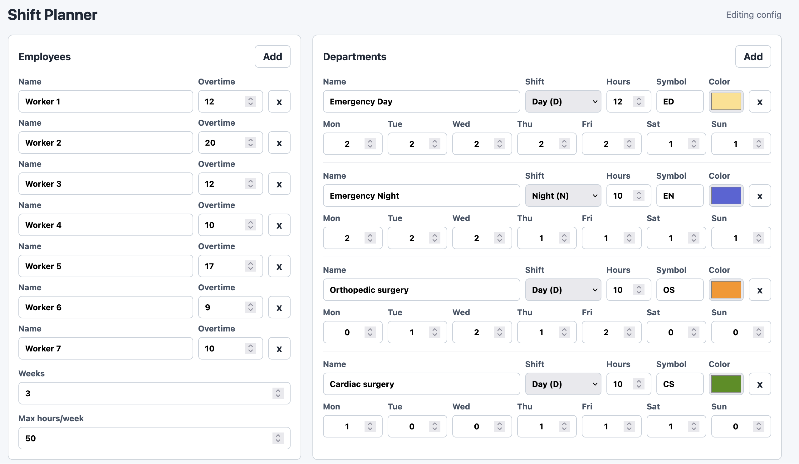
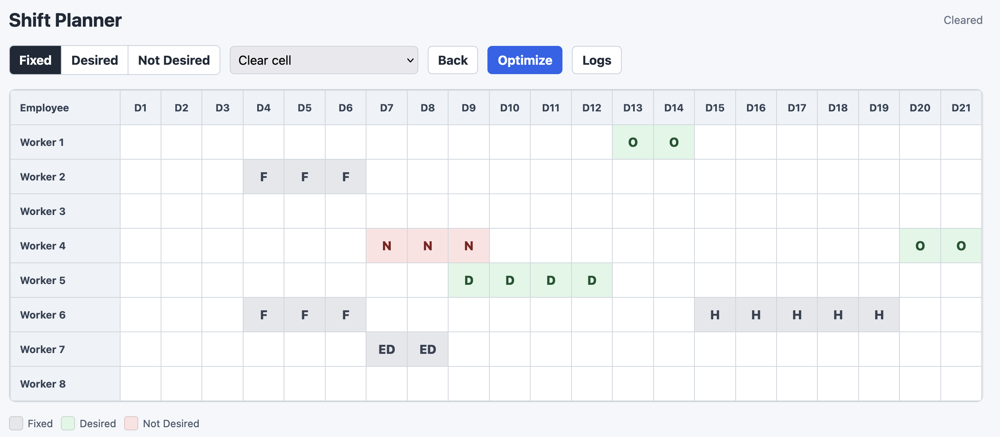
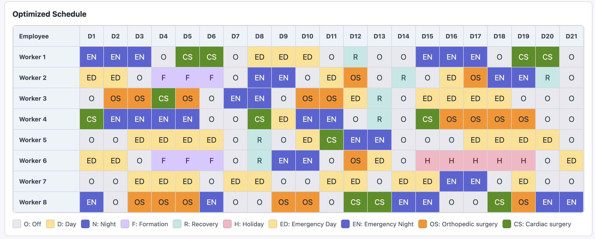

# MedShift

MedShift is a small local web app for planning hospital employee schedules. It
helps you turn staffing needs, employee availability, fixed assignments, shift
preferences, weekly hour limits, and overtime recovery into an optimized roster.

The app runs in your browser, but everything stays on your machine. There is no
database, no account system, and no hosted service to configure.

## What MedShift Helps With

- Configure employees, overtime balances, departments, shift symbols, colors,
  and weekly staffing needs.
- Mark fixed assignments, desired shifts, and not-desired shifts directly on a
  planning grid.
- Generate an optimized schedule with Google OR-Tools.
- Review the finished roster and inspect solver logs from the browser.
- Run the same scheduler from the command line when you want a quick solve.

## Screenshots

### Configure Employees And Departments

Set up the employees, planning horizon, maximum weekly hours, and department
requirements before optimizing.



### Add Constraints And Preferences

Paint fixed assignments, desired shifts, and not-desired shifts onto the grid.



### Review The Optimized Schedule

After optimization, MedShift shows the completed roster with color-coded shifts
and department assignments.



## Requirements

- Python 3.11 or newer
- `pip`
- `git`

Python 3.13 is recommended because that is the version used for the current
local test environment.

## Install And Run

If your GitHub SSH access is already configured, copy and paste this full block:

```sh
git clone git@github.com:Robin789-ch/MedShift.git
cd MedShift
python3.13 -m venv .venv
.venv/bin/python -m pip install --upgrade pip
.venv/bin/python -m pip install -r requirements.txt
.venv/bin/python -B frontend_server.py --port 8000
```

Then open:

[http://127.0.0.1:8000](http://127.0.0.1:8000)

Prefer HTTPS instead of SSH? Copy and paste this full block:

```sh
git clone https://github.com/Robin789-ch/MedShift.git
cd MedShift
python3.13 -m venv .venv
.venv/bin/python -m pip install --upgrade pip
.venv/bin/python -m pip install -r requirements.txt
.venv/bin/python -B frontend_server.py --port 8000
```

If you do not have `python3.13`, use this Python 3.11+ version instead:

```sh
git clone git@github.com:Robin789-ch/MedShift.git
cd MedShift
python3 -m venv .venv
.venv/bin/python -m pip install --upgrade pip
.venv/bin/python -m pip install -r requirements.txt
.venv/bin/python -B frontend_server.py --port 8000
```

Or, with HTTPS and Python 3.11+:

```sh
git clone https://github.com/Robin789-ch/MedShift.git
cd MedShift
python3 -m venv .venv
.venv/bin/python -m pip install --upgrade pip
.venv/bin/python -m pip install -r requirements.txt
.venv/bin/python -B frontend_server.py --port 8000
```

## Basic Workflow

1. Start the app and open [http://127.0.0.1:8000](http://127.0.0.1:8000).
2. Configure employees, overtime balances, number of weeks, and departments.
3. Click `Next`.
4. Mark fixed assignments or requests on the grid.
5. Click `Optimize`.
6. Review the color-coded schedule and, if needed, open the solver logs.

The default example uses these broad shifts:

- `O`: off
- `D`: day
- `N`: night
- `F`: formation/training
- `R`: overtime recovery
- `H`: holiday

## Run From The Command Line

You can also solve the example config without opening the browser:

```sh
.venv/bin/python -B scheduler.py --config=config.toml --params=max_time_in_seconds:10.0
```

If the browser app is already running on port `8000`, the command also sends the
latest solved schedule to the app.

## Customize The Example

The default schedule lives in `config.toml`.

Most users should start by changing:

- `num_employees`
- `num_weeks`
- `employee_overtime_hours`
- `fixed_assignments`
- `requests`
- `departments`
- `max_hours_per_week`

Department demand is configured per weekday:

```toml
[[departments]]
id = "day"
name = "Day"
shift = "D"
symbol = "D"
color = "#ffe08a"
duration_hours = 8
requirements = [5, 5, 4, 5, 4, 3, 4]
```

The `requirements` list starts on Monday and must contain up to seven numbers.

## Requests And Fixed Assignments

Fixed broad shift assignment:

```toml
fixed_assignments = [
  [0, "O", 0],
  [2, "D", 1],
]
```

Broad shift request:

```toml
requests = [
  [3, "O", 5, -4],
  [2, "N", 4, 6],
]
```

Negative weights mean desired. Positive weights mean not desired.

Department assignments use department IDs:

```toml
department_fixed_assignments = [
  [1, "day", 0],
]

department_requests = [
  [2, "night", 4, -4],
  [5, "day", 3, 4],
]
```

## Test

Run the test suite:

```sh
.venv/bin/python -B -m unittest discover
```

## Project Status

MedShift is ready for local testing and experimentation. It is still a small
prototype, so the optimizer can report that no feasible solution exists when
staffing requirements, fixed assignments, requests, and hour limits conflict.
