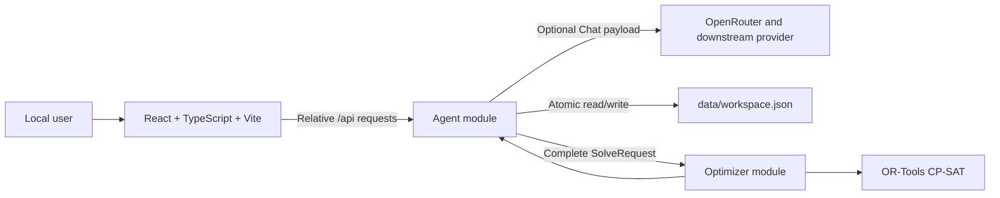

# MedShift V0.2 Local Prototype Design

| Field | Value |
|---|---|
| Status | Accepted after design grilling |
| Version | 0.2 |
| Date | 2026-07-30 |
| Runtime target | Local single-client prototype |
| Python | 3.14 |

## 1. Purpose

V0.2 replaces the embedded frontend/backend prototype with:

1. a React, TypeScript, and Vite frontend running on the host;
2. a containerized Agent module using FastAPI, PydanticAI, and OpenRouter;
3. a containerized stateless Optimizer module using FastAPI and OR-Tools;
4. one file-backed workspace owned by the Agent module.

The user edits scenario data directly, uses Chat to propose changes to a closed
catalogue of scheduling policies and optimization objectives, confirms those
changes, and solves the saved workspace synchronously.

V0.2 preserves the existing scheduling workflow while replacing positional and
overloaded configuration structures with exact typed contracts.

## 2. Scope

### 2.1 Goals

- Preserve Employee and Department setup, weekly demand editing, the full
  planning grid, department-aware results, and solver diagnostics.
- Persist one complete scheduling workspace locally.
- Give Employees and Departments stable identities.
- Keep Shift Types fixed and application-owned.
- Let the agent propose typed policy and objective changes.
- Require explicit confirmation before an agent-authored change becomes active.
- Show all active policies and objectives in a durable read-only panel.
- Send complete solve requests to a stateless Optimizer.
- Distinguish optimal, feasible, infeasible, unknown, and error outcomes.
- Keep HTTP and CLI solving behind the same Optimizer interface.
- Generate frontend API types from the Agent module's OpenAPI schema.

### 2.2 Non-goals

V0.2 does not include:

- authentication, accounts, organizations, or multiple workspaces;
- multiple clients, tabs, or concurrent user workflows;
- a database, queues, jobs, polling, streaming, or retries;
- durable Chat, pending proposals, solve results, or change history;
- a generic rule DSL, executable rule code, or plugin framework;
- department-specific run or transition policies;
- automatic objective-weight normalization;
- calendar dates, partial weeks, or date-specific demand;
- continuity with schedules outside the Planning Horizon;
- weekly variants of the workload or night-balance objectives;
- causal explanations for infeasible schedules;
- legacy `config.toml` import or automatic workspace migration;
- production privacy/legal guarantees or deployment infrastructure.

## 3. Domain ownership

The canonical vocabulary is defined in [`CONTEXT.md`](../CONTEXT.md).

### 3.1 Scenario data: direct user authority

The agent cannot modify:

- Planning Horizon;
- Employees, display names, overtime hours, or Weekly-Hours Ceilings;
- Departments, display metadata, durations, or Staffing Demand;
- Fixed Assignments;
- Employee Preferences;
- the fixed Shift Type catalogue;
- solver/runtime settings.

The React form and planning grid are the authoritative editors for these
concepts.

### 3.2 Agent authority

The agent may only add, update, or remove catalogue entries listed in
sections 6 and 7. It cannot approximate an unsupported request.

If a request has multiple plausible interpretations or targets, the agent asks
one clarifying question and creates no proposal.

### 3.3 Mathematical constraints are not product ownership

The following become CP-SAT constraints but remain scenario data or model
invariants, not agent-authored policies:

- exactly one Shift Type per Employee/day;
- exactly one Department for a demand-covering assignment;
- exact Department Staffing Demand;
- each Employee's Weekly-Hours Ceiling;
- Fixed Assignments;
- Shift Type eligibility;
- links between Departments and their Shift Types.

## 4. System shape



The frontend calls only the Agent module. The Optimizer never reads the
workspace file and never calls OpenRouter.

## 5. Deep modules and seams

### 5.1 Workspace module

The Workspace module hides parsing, schema-version checks, validation,
revision comparison, locking, serialization, fsync, and atomic replacement.

Its application-facing interface is conceptually:

```python
load() -> Workspace | None
save_scenario(base_revision: int, scenario: Scenario) -> Workspace
apply_changes(base_revision: int, changes: list[WorkspaceChange]) -> Workspace
```

The production adapter uses one JSON file. Tests use an in-memory adapter.
Callers never manipulate files or revisions themselves.

### 5.2 Agent module

The Agent module hides prompt construction, data minimization, PydanticAI
history, typed tools, pending-proposal state, validation, confirmation, and
domain-language projections.

Its HTTP routes are adapters over that behavior. The model cannot call the
Workspace adapter directly.

### 5.3 Optimizer module

The Optimizer module exposes one interface:

```python
solve(request: SolveRequest) -> SolveResult
```

This interface owns independent request validation, model construction, CP-SAT
execution, status mapping, schedule extraction, and structured diagnostics.

FastAPI and CLI are adapters over the same interface. Tests exercise the same
interface with deterministic requests.

### 5.4 Remote seams

The Agent-to-Optimizer seam has:

- an HTTP adapter in the running application;
- an in-memory adapter in Agent tests.

OpenRouter is a true external dependency. PydanticAI's test models replace it
in automated tests.

## 6. Fixed Shift Type catalogue

Shift Types are application-owned reference data and are not persisted in the
workspace.

| Enum | Code | Name | Demand | Night | Workload balance | Assignment hours | Overtime recovery | Eligibility |
|---|---|---|---:|---:|---:|---:|---:|---|
| `off` | `O` | Off | No | No | No | 0 | No | Automatic |
| `day` | `D` | Day | Yes | No | Yes | Department-owned | No | Automatic |
| `night` | `N` | Night | Yes | Yes | Yes | Department-owned | No | Automatic |
| `formation` | `F` | Formation | No | No | Yes | 8 | No | Fixed Assignment only |
| `recovery` | `R` | Recovery | No | No | No | 8 | Yes | Automatic |
| `holiday` | `H` | Holiday | No | No | Yes | 0 | No | Fixed Assignment or desired Employee Preference |

`counts_toward_workload_balance` replaces the misleading legacy
`counts_as_work` name. It does not control Assignment Hours.

A demand-covering assignment uses its Department duration. Any other
assignment uses the fixed Shift Type duration. All Assignment Hours count
toward the Employee's Weekly-Hours Ceiling. Recovery hours also reduce accrued
overtime.

Changing this catalogue requires an application and schema migration.

## 7. Exact durable workspace

### 7.1 Lifecycle

`data/workspace.json` does not exist before the first valid save. A missing file
means the workspace is uninitialized.

The first save creates revision `1`. Every successful later mutation increments
the revision by one.

An existing file must contain one complete valid `Workspace`. A malformed file
returns `workspace_corrupt`. An unsupported `schema_version` returns
`workspace_version_unsupported`. Neither is silently replaced.

### 7.2 Common scalar types

```python
EmployeeId = UUID
DepartmentId = UUID
DecisionId = UUID
ProposalId = UUID
DayIndex = Annotated[int, Field(ge=0)]
ObjectiveWeight = Annotated[int, Field(gt=0)]
```

IDs are server-generated and immutable. Employee and Department IDs are used
by the frontend but are not displayed to users or sent to OpenRouter. Policy
and objective IDs are internal to the Agent and Optimizer modules.

### 7.3 Scenario models

```python
class Employee(BaseModel):
    employee_id: EmployeeId
    display_name: Annotated[str, Field(min_length=1)]
    overtime_hours: Annotated[int, Field(ge=0, le=1000)]
    weekly_hours_ceiling: Annotated[int, Field(ge=1, le=168)]


class Department(BaseModel):
    department_id: DepartmentId
    display_name: Annotated[str, Field(min_length=1)]
    shift_type: Literal[ShiftType.DAY, ShiftType.NIGHT]
    symbol: Annotated[str, Field(min_length=1, max_length=3)]
    color: Annotated[str, Field(pattern=r"^#[0-9A-Fa-f]{6}$")]
    duration_hours: Annotated[int, Field(ge=1, le=24)]
    staffing_demand: tuple[
        NonNegativeInt,
        NonNegativeInt,
        NonNegativeInt,
        NonNegativeInt,
        NonNegativeInt,
        NonNegativeInt,
        NonNegativeInt,
    ]


class ShiftTypeTarget(BaseModel):
    kind: Literal["shift_type"]
    shift_type: ShiftType


class DepartmentTarget(BaseModel):
    kind: Literal["department"]
    department_id: DepartmentId


AssignmentTarget = Annotated[
    ShiftTypeTarget | DepartmentTarget,
    Field(discriminator="kind"),
]


class FixedAssignment(BaseModel):
    kind: Literal["fixed_assignment"]
    employee_id: EmployeeId
    day_index: DayIndex
    target: AssignmentTarget


class EmployeePreference(BaseModel):
    kind: Literal["employee_preference"]
    employee_id: EmployeeId
    day_index: DayIndex
    target: AssignmentTarget
    direction: Literal["desired", "avoided"]


PlanningEntry = Annotated[
    FixedAssignment | EmployeePreference,
    Field(discriminator="kind"),
]


class Scenario(BaseModel):
    planning_weeks: Annotated[int, Field(ge=1, le=12)]
    employees: Annotated[list[Employee], Field(min_length=1)]
    departments: list[Department]
    planning_entries: list[PlanningEntry]
```

Scenario validation enforces:

- unique Employee IDs and Department IDs;
- all references exist;
- `day_index < planning_weeks * 7`;
- no more than one Planning Entry per Employee/day;
- Department targets imply their Department's Shift Type;
- Fixed Assignment and Employee Preference targets obey the fixed Shift Type
  eligibility table;
- Staffing Demand is exactly seven Monday-through-Sunday values;
- Departments use only demand-covering Shift Types.

It does not attempt to prove feasibility.

### 7.4 Policy models

```python
class ConsecutiveShiftLimit(BaseModel):
    id: DecisionId
    kind: Literal["consecutive_shift_limit"]
    shift_type: ShiftType
    minimum_run_length: int | None
    maximum_run_length: int | None


class WeeklyShiftCountLimit(BaseModel):
    id: DecisionId
    kind: Literal["weekly_shift_count_limit"]
    shift_type: ShiftType
    minimum_count: Annotated[int, Field(ge=0, le=7)] | None
    maximum_count: Annotated[int, Field(ge=0, le=7)] | None


class ForbiddenShiftTransition(BaseModel):
    id: DecisionId
    kind: Literal["forbidden_shift_transition"]
    from_shift_type: ShiftType
    to_shift_type: ShiftType


Policy = Annotated[
    ConsecutiveShiftLimit
    | WeeklyShiftCountLimit
    | ForbiddenShiftTransition,
    Field(discriminator="kind"),
]
```

For bounded entries:

- at least one bound is present;
- present run lengths are positive and no longer than the Planning Horizon;
- minimum does not exceed maximum.

Missing means genuinely unbounded. No sentinel values are permitted.

### 7.5 Objective models

```python
class WeightedBound(BaseModel):
    value: int
    weight: ObjectiveWeight


class ConsecutiveShiftPreference(BaseModel):
    id: DecisionId
    kind: Literal["consecutive_shift_preference"]
    shift_type: ShiftType
    preferred_minimum: WeightedBound | None
    preferred_maximum: WeightedBound | None


class WeeklyShiftCountPreference(BaseModel):
    id: DecisionId
    kind: Literal["weekly_shift_count_preference"]
    shift_type: ShiftType
    preferred_minimum: WeightedBound | None
    preferred_maximum: WeightedBound | None


class ShiftTransitionPreference(BaseModel):
    id: DecisionId
    kind: Literal["shift_transition_preference"]
    from_shift_type: ShiftType
    to_shift_type: ShiftType
    direction: Literal["encourage", "discourage"]
    weight: ObjectiveWeight


class EmployeePreferenceObjective(BaseModel):
    id: DecisionId
    kind: Literal["employee_preference_objective"]
    desired_weight: ObjectiveWeight
    avoided_weight: ObjectiveWeight


class WorkloadBalanceObjective(BaseModel):
    id: DecisionId
    kind: Literal["workload_balance_objective"]
    weight: ObjectiveWeight


class NightShiftBalanceObjective(BaseModel):
    id: DecisionId
    kind: Literal["night_shift_balance_objective"]
    weight: ObjectiveWeight


class RemainingOvertimeObjective(BaseModel):
    id: DecisionId
    kind: Literal["remaining_overtime_objective"]
    weight: ObjectiveWeight


class MaximumRemainingOvertimeObjective(BaseModel):
    id: DecisionId
    kind: Literal["maximum_remaining_overtime_objective"]
    weight: ObjectiveWeight


class ExcessRecoveryObjective(BaseModel):
    id: DecisionId
    kind: Literal["excess_recovery_objective"]
    weight: ObjectiveWeight


class ConsecutiveDepartmentContinuityObjective(BaseModel):
    id: DecisionId
    kind: Literal["consecutive_department_continuity_objective"]
    weight: ObjectiveWeight


Objective = Annotated[
    ConsecutiveShiftPreference
    | WeeklyShiftCountPreference
    | ShiftTransitionPreference
    | EmployeePreferenceObjective
    | WorkloadBalanceObjective
    | NightShiftBalanceObjective
    | RemainingOvertimeObjective
    | MaximumRemainingOvertimeObjective
    | ExcessRecoveryObjective
    | ConsecutiveDepartmentContinuityObjective,
    Field(discriminator="kind"),
]
```

Weighted preferences require at least one bound. Consecutive values are
positive and within the Planning Horizon; weekly values are within `0...7`;
present minimum values do not exceed present maximum values.

Objective Weights are positive integers. Direction is explicit. Zero,
negative weights, and named importance levels are not accepted.

The contracts allow a preference that is redundant with a hard policy. The
agent should notice such redundancy, but cross-policy usefulness is not a
validation responsibility.

### 7.6 Uniqueness

Only one active entry may exist per natural key:

- each run/count policy or objective per Shift Type;
- each forbidden or preferred transition per ordered Shift Type pair;
- one instance of each global objective.

Adding a duplicate fails with `decision_invalid`; callers must update the
existing entry. Weights never stack through duplicates.

### 7.7 Workspace

```python
class Workspace(BaseModel):
    schema_version: Literal[1]
    revision: Annotated[int, Field(ge=1)]
    scenario: Scenario
    policies: list[Policy]
    objectives: list[Objective]
```

Human-readable summaries are derived from these validated models and are never
persisted as an independent source of truth.

## 8. Temporal and objective semantics

- The Planning Horizon is `1...12` complete Monday-through-Sunday weeks.
- Staffing Demand repeats by weekday and is exact, not a minimum.
- Run, transition, and Department-continuity semantics cross Sunday-to-Monday
  boundaries.
- Weekly shift counts and Weekly-Hours Ceilings reset each Monday.
- Runs touching the first or last horizon day are treated as complete.
- Assignments outside the horizon are unknown and ignored.
- Workload and night balancing compare Employee totals across the entire
  Planning Horizon, not per week.
- Consecutive Department continuity rewards keeping the same Department on
  adjacent days with the same Shift Type. Another Shift Type or an intervening
  day ends the run.
- Employee Preferences contain direction only. Their two global weights live
  in `EmployeePreferenceObjective`.
- Overtime recovery uses three independent objectives: total remaining,
  maximum individual remaining, and excess recovery.
- Valid but contradictory scenario data, policies, and objectives are accepted
  and may solve as infeasible.

## 9. Scenario editing

### 9.1 Local draft

Form and grid edits remain a frontend-local draft until **Save changes**.

While dirty:

- Chat and Solve are greyed out and disabled;
- no explanatory warning is required;
- reload or navigation silently discards the draft.

### 9.2 Save

The frontend sends the complete Scenario plus its `base_revision`.

The Workspace module validates the complete prospective workspace, commits it
atomically, and increments the revision.

Scenario changes preserve every still-valid policy, objective, Fixed
Assignment, and Employee Preference.

### 9.3 Dependency-aware deletion

Deleting an Employee or Department first shows how many Planning Entries will
also be removed. Confirmation sends one already-reconciled Scenario; the server
validates that no dangling references remain.

Shortening the Planning Horizon similarly previews and removes only entries
outside the new horizon.

Renames, demand edits, overtime changes, and Weekly-Hours Ceiling changes do
not clear policies or objectives.

## 10. Agent change model

### 10.1 Internal tools

The agent has exactly two application tools:

```text
list_active_decisions()
propose_changes(changes: list[WorkspaceChange])
```

`list_active_decisions` returns typed internal policies and objectives to the
model.

`propose_changes`:

1. applies all changes to a request-scoped working copy;
2. validates the complete prospective workspace;
3. derives a domain-language diff;
4. stages one request-scoped proposal candidate;
5. never writes the workspace.

The Agent module publishes that candidate as the single pending proposal only
after the complete model run succeeds. A later provider or tool failure drops
the candidate.

### 10.2 Change models

`WorkspaceChange` is a closed discriminated union of:

- `add_policy`;
- `update_policy`;
- `remove_policy`;
- `add_objective`;
- `update_objective`;
- `remove_objective`.

An update carries the internal decision ID and one complete typed replacement.
The ID is preserved. A type change requires remove-plus-add in the same change
set. Partial patches and generic parameter dictionaries are forbidden.

### 10.3 Confirmation

Every mutating Chat response creates a blocking proposal review:

- plain-language additions, before/after updates, and removals;
- **Apply** and **Cancel** actions;
- all scenario editing, Chat, and Solve disabled until a decision;
- one pending proposal maximum.

Apply rechecks `base_revision`, validates, atomically commits the entire set,
increments the revision, and refreshes the active panel.

Cancel discards the pending set and leaves the workspace unchanged.

The proposal remains in visible and model conversation history with a
deterministic Applied or Cancelled status.

### 10.4 Failure semantics

- Any invalid change invalidates the complete proposal.
- A failed model call changes neither history nor workspace.
- A stale base revision returns `revision_conflict`; V0.2 does not merge.
- An ambiguous request produces clarification and no proposal.
- An unsupported request is declined; the agent never approximates it.

## 11. Agent context and privacy

### 11.1 Data sent to OpenRouter

Chat sends:

- the user's current message;
- ephemeral model conversation history;
- fixed Shift Type definitions;
- active policies and objectives;
- Planning Horizon length;
- Employee and Department counts;
- aggregate demand and hour ranges needed for weight reasoning.

Chat does not automatically send:

- Employee names or IDs;
- individual overtime or Weekly-Hours Ceiling values;
- Fixed Assignments or Employee Preferences;
- Department names, symbols, colors, or IDs;
- the complete workspace.

User-entered Chat text is sent verbatim and may itself contain identifying
information.

### 11.2 Consent

The non-agent workflow remains fully usable without an API key or consent.

Before first Chat use, a versioned disclosure explains:

- exactly what MedShift sends;
- that data leaves the machine for OpenRouter and downstream providers;
- that providers may retain or use content;
- that identifying patient or Employee information must not be typed into Chat.

Acceptance is stored only in browser-local storage, survives refresh/restart,
and is requested again when the notice version changes. The user can revoke it.
Consent is not part of the workspace and no external consent record is created.

### 11.3 Prototype routing limitation

V0.2 uses standard OpenRouter routing. It does not require Zero Data Retention
or `data_collection: "deny"`.

This is not a privacy guarantee. Privacy/legal review and enforceable provider
routing are deployment blockers. See
[`openrouter-privacy-and-retention.md`](research/openrouter-privacy-and-retention.md).

## 12. PydanticAI integration

Use the native OpenRouter integration:

```text
pydantic-ai-slim[openrouter]
OpenRouterModel
OpenRouterProvider
```

The model slug is runtime configuration. The model must support reliable tool
calling. Automated tests use PydanticAI test/function models.

Maintain one server-side in-memory PydanticAI message list:

```python
result = await agent.run(message, message_history=history)
history = result.all_messages()
```

Replacing history with `all_messages()` is valid. Alternatively, extending the
old list with `new_messages()` is valid. Appending `all_messages()` to the old
list is forbidden because it duplicates prior turns.

Synthetic Applied/Cancelled status messages are server-owned history entries,
not client-supplied model history.

The model-call timeout is 60 seconds with no application retry. Provider failures
leave history, pending proposal state, and workspace unchanged.

## 13. Workspace concurrency and persistence

### 13.1 Revision checks

Every Scenario save and pending proposal captures a base revision.

The Workspace module holds one short application lock while it:

1. reloads and validates the current workspace;
2. compares the base revision;
3. constructs and validates the prospective workspace at the next revision;
4. writes and fsyncs a temporary file in the same directory;
5. replaces the target through `os.replace`;
6. updates the in-memory/current workspace view to the committed value.

The lock is never held during model calls, user confirmation, or solving.

### 13.2 Single-client serialization

V0.2 models one client:

- dirty scenario draft disables Chat and Solve;
- pending proposal disables every other workspace action;
- active Solve disables editing, Chat, Save, and duplicate Solve;
- therefore a SolveResult always belongs to the current workspace.

V0.2 has no stale-solve result or multi-client merge behavior.

### 13.3 Ephemeral state

Chat history, pending proposals, and SolveResults are memory/UI state only.
Refresh or Agent-module restart clears Chat and cancels a pending proposal without
changing the workspace.

The read-only active panel is reconstructed from persisted current state.

## 14. Solve contracts

### 14.1 SolveRequest

The Agent constructs a presentation-free request:

```python
class SolveRequest(BaseModel):
    schema_version: Literal[1]
    workspace_revision: int
    planning_weeks: int
    employees: list[SolveEmployee]
    departments: list[SolveDepartment]
    planning_entries: list[PlanningEntry]
    policies: list[Policy]
    objectives: list[Objective]
```

`SolveEmployee` contains only ID, overtime hours, and Weekly-Hours Ceiling.
`SolveDepartment` contains only ID, Shift Type, duration, and Staffing Demand.
Names, symbols, and colors never enter the Optimizer module.

The Optimizer validates all values, references, bounds, uniqueness, and
catalogue variants independently. It does not trust Agent validation.

### 14.2 Schedule

```python
class DayAssignment(BaseModel):
    day_index: DayIndex
    shift_type: ShiftType
    department_id: DepartmentId | None


class EmployeeSchedule(BaseModel):
    employee_id: EmployeeId
    days: list[DayAssignment]


class Schedule(BaseModel):
    employees: list[EmployeeSchedule]
```

Every Employee has exactly one ordered entry for every horizon day.
Demand-covering Shift Types require a Department ID; other Shift Types require
`null`.

The Agent/frontend resolves IDs against the same saved workspace revision to
show Employee names, Department symbols, and colors.

### 14.3 Diagnostics

```python
class ObjectiveContribution(BaseModel):
    objective_id: DecisionId
    contribution: int


class SolveDiagnostics(BaseModel):
    wall_time_seconds: float
    conflicts: int
    branches: int
    objective_value: int | None
    best_objective_bound: float | None
    contributions: list[ObjectiveContribution]
```

The Agent maps contribution IDs to domain-language objective summaries before
returning them to the frontend. Raw CP-SAT variables, expressions, stack
traces, and console output remain in local module logs.

### 14.4 SolveResult

`SolveResult` is a discriminated union:

| Status | Schedule | Objective | Meaning |
|---|---|---|---|
| `optimal` | Required | Required | Best schedule proven |
| `feasible` | Required | Required | Schedule found; optimality not proven |
| `infeasible` | Absent | Absent | No schedule exists, proven |
| `unknown` | Absent | Absent | Limit reached without a schedule or proof |

All four are HTTP `200` business outcomes.

CP-SAT `MODEL_INVALID` maps to a `model_invalid` application error. Unexpected
exceptions map to `solve_failed`.

V0.2 does not claim a cause for infeasibility and never asks the LLM to guess
one.

### 14.5 Solver runtime

`SOLVER_MAX_TIME_SECONDS` is runtime configuration with default `60`.

- The Agent-to-Optimizer timeout is slightly longer.
- CLI may override with `--max-time-seconds`.
- Frontend and agent tools cannot change it.
- Time limit with a schedule returns `feasible`.
- Time limit without a schedule or proof returns `unknown`.

## 15. HTTP adapters

### 15.1 Agent routes

All frontend routes are mounted below `/api`; Vite proxies `/api` without
rewriting.

| Method | Route | Behavior |
|---|---|---|
| `GET` | `/api/health` | Shallow Agent liveness/configuration |
| `GET` | `/api/state` | Initialization state, Scenario, revision, Shift Type views, active decision views |
| `PUT` | `/api/scenario` | Save complete Scenario against `base_revision` |
| `POST` | `/api/chat` | Run one Chat turn; optionally return one pending proposal view |
| `DELETE` | `/api/chat` | Clear history and cancel any pending proposal |
| `POST` | `/api/proposals/{id}/apply` | Confirm and commit pending change set |
| `POST` | `/api/proposals/{id}/cancel` | Cancel pending change set |
| `POST` | `/api/solve` | Solve current saved workspace |

`GET /api/state` returns `initialized: false` when no workspace exists. Chat and
Solve against that state return `workspace_not_initialized`.

The frontend receives derived policy/objective titles, summaries, and detail
rows, not decision IDs or raw discriminated models.

### 15.2 Optimizer routes

| Method | Route | Behavior |
|---|---|---|
| `GET` | `/health` | Startup and OR-Tools import check |
| `POST` | `/solve` | Complete `SolveRequest` to `SolveResult` |

The Optimizer maintains no workspace, Chat, proposal, or result state.

## 16. Stable error contract

Both modules replace framework-specific validation responses with:

```json
{
  "error": {
    "code": "revision_conflict",
    "message": "The workspace changed before this proposal was applied.",
    "details": {}
  }
}
```

| Code | HTTP | Meaning |
|---|---:|---|
| `request_invalid` | 422 | Malformed request contract |
| `workspace_not_initialized` | 409 | Operation requires a saved workspace |
| `workspace_corrupt` | 500 | Existing file cannot be parsed or validated |
| `workspace_version_unsupported` | 409 | File schema version is not supported |
| `revision_conflict` | 409 | Base revision is stale |
| `proposal_pending` | 409 | Another proposal awaits confirmation |
| `proposal_not_found` | 409 | Proposal expired, was cancelled, or never existed |
| `decision_invalid` | 422 | Invalid policy/objective or broken reference |
| `agent_unavailable` | 503 | OpenRouter/model call failed or timed out |
| `optimizer_unavailable` | 503 | Optimizer transport failed or timed out |
| `model_invalid` | 500 | Optimizer produced an invalid CP-SAT model |
| `solve_failed` | 500 | Unexpected solve failure |

Provider bodies, stack traces, and raw solver errors stay in local logs.

## 17. Frontend behavior

### 17.1 Preserved workflow

React preserves:

- Employee creation, removal, naming, overtime, and individual Weekly-Hours
  Ceilings;
- Planning Horizon editing;
- Department creation, removal, naming, Shift Type, duration, symbol, color,
  and exact weekday demand;
- the full planning grid;
- Fixed, Desired, and Avoided modes;
- Shift Type and Department targets;
- department-aware schedule rendering;
- expandable structured solver diagnostics.

The one-entry-per-Employee/day grid invariant remains.

### 17.2 Active decisions

An always-available read-only panel separates:

- Scheduling Policies;
- Optimization Objectives.

It shows derived domain-language summaries and numeric Objective Weights.
It has no edit, remove, disable, raw JSON, or internal-ID controls.

All mutations go through Chat proposal and confirmation.

### 17.3 Chat

- Chat is optional and consent-gated.
- One request at a time.
- No streaming.
- Read-only answers require no confirmation.
- Mutations enter blocking proposal review.
- Refresh clears visible and server-side Chat.

### 17.4 Solve results

The UI distinctly renders:

- optimal schedule;
- feasible schedule with optimality-not-proven label;
- infeasible outcome without invented cause;
- unknown outcome with retry guidance;
- structured objective contributions and solver statistics;
- stable application errors.

Raw solver logs are not shown in the browser.

## 18. Repository and dependency layout

```text
.
├── compose.yaml
├── pyproject.toml
├── uv.lock
├── .python-version
├── README.md
├── CONTEXT.md
├── data/
│   └── .gitkeep
├── frontend/
│   ├── package.json
│   ├── package-lock.json
│   ├── vite.config.ts
│   └── src/
├── packages/
│   └── contracts/
│       ├── pyproject.toml
│       └── src/medshift_contracts/
├── services/
│   ├── agent/
│   │   ├── Dockerfile
│   │   ├── pyproject.toml
│   │   ├── src/medshift_agent/
│   │   └── tests/
│   └── optimizer/
│       ├── Dockerfile
│       ├── pyproject.toml
│       ├── src/medshift_optimizer/
│       └── tests/
└── docs/
    ├── adr/
    ├── research/
    └── v0.2-local-design.md
```

The root is one `uv` workspace with one committed `uv.lock`. Each member
declares only its dependencies. Both Dockerfiles use the repository root as
build context and install only their module plus shared contracts.

Python 3.14 is used everywhere. OR-Tools 9.15 already has Python 3.14 Linux
ARM64 and x86-64 wheels in the current lockfile.

Frontend DTOs are generated from the Agent module's OpenAPI schema. The
generation command is committed, generated output is checked in, and the
verification task fails when it is stale.

## 19. Local runtime

### 19.1 Processes

| Module | Host | Container |
|---|---|---|
| Frontend | `http://localhost:5173` | Host Vite process |
| Agent | `http://localhost:8000` | `agent:8000` |
| Optimizer | `http://localhost:8001` | `optimizer:8001` |

Only Agent mounts `./data:/data`. Optimizer never mounts workspace data.

Vite proxies `/api/*` to `http://localhost:8000/api/*`, so no rewrite or CORS
middleware is required.

### 19.2 Runtime configuration

```text
OPENROUTER_API_KEY=
OPENROUTER_MODEL=
OPTIMIZER_URL=http://optimizer:8001
WORKSPACE_PATH=/data/workspace.json
MODEL_TIMEOUT_SECONDS=60
OPTIMIZER_TIMEOUT_SECONDS=70
SOLVER_MAX_TIME_SECONDS=60
LOG_LEVEL=INFO
```

The key is available only to Agent. `.env` and `workspace.json` are ignored by
Git and excluded from Docker build contexts.

## 20. CLI adapter

The retained CLI:

- reads a V0.2 workspace JSON file;
- constructs the same `SolveRequest`;
- invokes the Optimizer interface in-process;
- prints the same typed status, schedule, and diagnostics;
- accepts `--max-time-seconds`;
- never parses legacy TOML;
- never posts to the frontend.

## 21. Testing strategy

### 21.1 Contracts

- Accept one complete representative Workspace and SolveRequest.
- Round-trip every discriminated policy, objective, change, and SolveResult.
- Reject unknown discriminators, duplicate natural keys, invalid bounds,
  invalid references, and invalid Planning Entry collisions.
- Accept well-formed contradictory workspaces.
- Verify schema-version mismatch behavior.
- Generate OpenAPI and verify committed TypeScript types are current.

### 21.2 Workspace module

- Missing file remains uninitialized until first save.
- First save creates revision `1`.
- Atomic replacement leaves no torn workspace.
- Revision conflicts never overwrite newer state.
- Corrupt and unsupported files are preserved and reported.
- Scenario renames preserve all dependent state.
- Confirmed deletion removes only previewed dependent entries.
- Shortened horizon removes only out-of-range entries.

### 21.3 Agent module

- Redacted context contains no structured per-Employee or Department data.
- Ambiguous and unsupported messages create no proposal.
- One batched tool proposal validates all-or-nothing.
- Add, full update, and removal produce correct domain diffs.
- Apply commits once; Cancel changes nothing.
- Pending review blocks other actions.
- Applied/Cancelled statuses remain in ephemeral history.
- Failed model runs preserve history and workspace.
- History replacement never duplicates previous messages.
- Automated tests use PydanticAI test/function models and no network.

### 21.4 Optimizer module

The existing nine solver behaviors are retained through the new interface:

1. Department preferences affect one joint model.
2. Stable Department IDs are respected.
3. Fixed Department assignments imply their broad Shift Type.
4. Conflicting broad and Department assignments are infeasible.
5. Consecutive Department continuity prefers adjacent-day continuity.
6. Department duration contributes to Weekly-Hours Ceilings.
7. Formation and Recovery hours count toward ceilings while Holiday contributes
   zero hours.
8. Overtime objectives prefer appropriate Recovery.
9. Excess Recovery is discouraged.

Additionally:

- every catalogue entry has one deterministic translation test;
- optimal, feasible, infeasible, and unknown map correctly;
- model invalidity maps to `model_invalid`;
- output schedules contain one valid assignment per Employee/day;
- objective contributions sum to the total objective value;
- no presentation metadata appears in SolveRequest or Schedule.

### 21.5 HTTP adapters

- Agent and Optimizer health routes are shallow.
- FastAPI validation uses the stable error envelope.
- Agent maps optimizer transport failures to `optimizer_unavailable`.
- Infeasible and unknown remain HTTP `200`.
- HTTP and CLI outcomes match the core Optimizer interface.

### 21.6 Frontend

- TypeScript compilation and production build pass.
- Dirty draft disables Chat and Solve.
- Pending proposal blocks all other actions.
- Apply/Cancel refreshes the expected views.
- Active decision projection is read-only.
- Manual smoke test covers setup, grid, save, Chat proposal, confirmation,
  Solve, results, and diagnostics.

### 21.7 Real-provider smoke test

One manual OpenRouter test confirms:

- consent precedes the first external request;
- the configured model calls only registered tools;
- a mutation creates a proposal but does not commit;
- internal decision IDs, tool names, and schemas are not exposed;
- unsupported Department-specific requests are declined;
- final explanations use domain language.

## 22. Acceptance criteria

V0.2 is complete when:

1. `docker compose up --build` starts healthy Agent and Optimizer modules.
2. `npm run dev` starts the React frontend.
3. Python 3.14 and one root `uv.lock` are used throughout.
4. The first valid Scenario save creates revision `1`.
5. Reload restores Scenario, policies, and objectives but clears Chat, pending
   proposals, SolveResult, and unsaved drafts.
6. Employees and Departments retain stable identity across rename and reorder.
7. Every Employee has a valid individual Weekly-Hours Ceiling.
8. Exact weekday Staffing Demand is persisted per Department.
9. The complete current planning-grid workflow works for Shift Type and
   Department targets.
10. Dirty drafts cannot invoke Chat or Solve.
11. The active policy/objective panel is complete, durable, and read-only.
12. Chat remains disabled until versioned external-data consent is accepted.
13. Structured OpenRouter context contains no per-Employee or Department data.
14. Every catalogue type can be added, fully updated, and removed through one
    typed proposal.
15. Ambiguous or unsupported requests never create approximate changes.
16. Every mutating proposal requires Apply; Cancel leaves the workspace
    unchanged.
17. A complete self-contained SolveRequest reaches the stateless Optimizer.
18. HTTP and CLI use the same Optimizer interface.
19. Optimal and feasible results return normalized ID-based schedules.
20. Infeasible and unknown are displayed as business outcomes, not system
    errors.
21. Structured diagnostics show total objective and per-objective
    contributions without raw solver logs.
22. Corrupt, unsupported-version, invalid-decision, model-invalid, and
    infrastructure failures use their stable error codes.
23. The nine existing solver behaviors pass through the new interface.
24. Automated tests make no LLM network request.
25. Generated TypeScript DTOs match the Agent OpenAPI schema.

## 23. Explicit future work

Do not implement these as part of V0.2:

- normalized or scenario-size-aware Objective Weights;
- Department-specific run limits, preferences, and transitions;
- previous/next roster boundary state;
- weekly workload and night balancing;
- explainable infeasibility with assumptions/unsatisfiable cores;
- durable audit history or Chat;
- multiple clients and merge behavior;
- strict provider allowlists, ZDR enforcement, privacy/legal deployment review;
- legacy configuration migration;
- production authentication, storage, jobs, monitoring, or deployment.

## 24. References

- [PydanticAI OpenRouter provider](https://pydantic.dev/docs/ai/models/openrouter/)
- [PydanticAI messages and chat history](https://pydantic.dev/docs/ai/core-concepts/message-history/)
- [OpenRouter privacy and retention research](research/openrouter-privacy-and-retention.md)
- [Domain glossary](../CONTEXT.md)
- [Architecture decisions](adr/)
